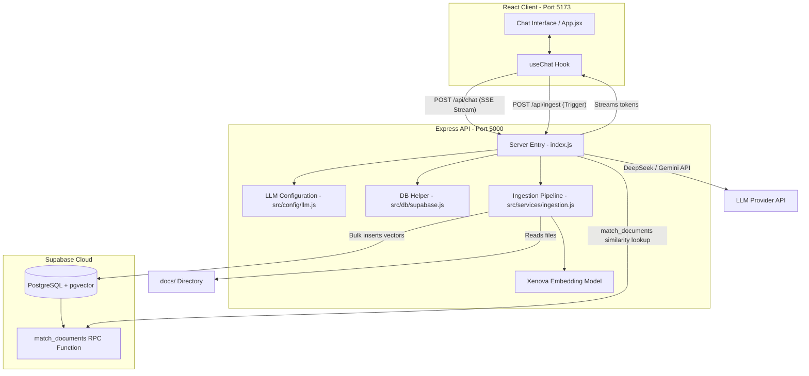

# RAG Chatbot - Monorepo

A lightweight, high-performance RAG (Retrieval-Augmented Generation) Chatbot monorepo built using the MERN stack (Node.js/Express backend, React/Vite/Tailwind CSS v4 frontend) and Supabase as the Vector Database.

---

## 🏗️ Architecture Overview

The system is structured as a monorepo consisting of:
1. **Frontend**: A React 19 single-page application built on Vite 8, featuring a modern, fully-responsive ChatGPT-style dark theme using Tailwind CSS v4 and Google Fonts (`Outfit` + `Hind Siliguri` for clean English and Bengali rendering).
2. **Backend**: A Node.js v20 Express server handling file ingestion, text chunking, local vector embedding calculations, and OpenAI-compatible streaming LLM endpoint configuration.
3. **Database (Supabase)**: Relies on `pgvector` to perform similarity indexing and cosine similarity search matches.

### System Architecture Flow (Mermaid)



---

## ⚡ Setup & Execution Instructions

Ensure you have **Node.js (v20+)** and **npm** installed.

### Configuration (`.env`)
1. Copy the environment template:
   ```bash
   cp .env.example .env
   ```
2. Populate the environment variables in `.env`:
   - `SUPABASE_URL`: Your Supabase Project URL.
   - `SUPABASE_ANON_KEY`: Your Supabase anonymous API key.
   - `DEEPSEEK_API_KEY`: Your API key for the DeepSeek (or other OpenAI-compatible) LLM.

---

### Option A: Local Run (No Docker required)

Start both services locally using your command prompt or terminal:

#### 1. Ingest Documents (Optional)
Put your PDF and Image documents inside the `docs/` folder at the root. Then run the ingestion script to parse them, calculate embeddings, and store them in Supabase:
```bash
cd backend
npm install
npm run ingest
```

#### 2. Run the Backend API Server
```bash
# Inside the /backend folder
npm run dev
```
*Backend runs on **[http://localhost:5000](http://localhost:5000)**.*

#### 3. Run the Frontend Client
Open a second terminal window:
```bash
cd frontend
npm install
npm run dev
```
*Frontend runs on **[http://localhost:5173](http://localhost:5173)**.*

---

### Option B: Zero-Step Containerization (Docker Compose)
If you have Docker Desktop installed, you can spin up the entire stack with a single command from the root directory:

```bash
docker compose up --build
```
*Docker Compose handles network routing, environment loading, and sets up live volume synchronization for hot-reloads during code changes.*

---

## 🛠️ Supabase Database Migration

Ensure your Supabase project has `pgvector` enabled and create the standard documents table. Run the SQL commands in [supabase_migration.sql](file:///d:/job_Task/rag-chatbot-nbr/backend/supabase_migration.sql) inside your Supabase **SQL Editor**:

```sql
-- Enable vector extension
create extension if not exists vector;

-- Create documents storage table
create table if not exists documents (
  id bigserial primary key,
  content text not null,
  metadata jsonb,
  embedding vector(384) -- Matches 384 dimensions of the local all-MiniLM-L6-v2 model
);

-- Cosine similarity match RPC function
create or replace function match_documents (
  query_embedding vector(384),
  match_threshold float,
  match_count int
)
returns table (
  id bigint,
  content text,
  metadata jsonb,
  similarity float
)
language plpgsql
as $$
begin
  return query
  select
    documents.id,
    documents.content,
    documents.metadata,
    1 - (documents.embedding <=> query_embedding) as similarity
  from documents
  where 1 - (documents.embedding <=> query_embedding) > match_threshold
  order by documents.embedding <=> query_embedding
  limit match_count;
end;
$$;

-- Create HNSW speed optimization index
create index if not exists documents_embedding_hnsw_idx 
on documents using hnsw (embedding vector_cosine_ops);
```

---

## 🧠 Key Architectural Decisions

### 1. Vector Database: Why pgvector & Supabase?
- **Seamless Stack Integration**: Since Supabase is an open-source Firebase alternative built on PostgreSQL, utilizing `pgvector` allows us to store documents, metadata, and embeddings together in a single relational DB instead of maintaining a separate standalone vector DB (like Pinecone or Milvus).
- **Standard SQL Querying**: We can query vectors directly using SQL expressions or RPC functions, making it easier to filter by metadata or combine vector searches with traditional structured queries.
- **Cost Effective**: Supabase provides a free tier containing complete `pgvector` functionality, which fits perfectly for developer-friendly local or cloud setups.

### 2. Embedding Model: Why Local Xenova Transformers (`all-MiniLM-L6-v2`)?
- **Zero Cost & Unlimited Limits**: Instead of paying for API calls (e.g. OpenAI `text-embedding-3-small`) and worrying about rate limits or network latency, we generate embeddings directly on the server host using `@xenova/transformers`.
- **Lightweight Footprint**: The `all-MiniLM-L6-v2` model is extremely compact (approx. 90MB), runs efficiently on CPU container instances, and yields excellent performance for general text retrieval.
- **Fast Similarity Indexing**: Generating `384` dimension embeddings consumes less network storage and memory resources, speeding up index query lookups compared to `1536` dimension vectors.

### 3. Chunking Strategy: Why Overlapping Slips?
- **Standard Chunk Size (500 Words)**: Splits the extracted raw text into chunks of 500 words. This provides enough surrounding context for the LLM to understand and form an accurate answer while remaining small enough to fit within model prompt limits.
- **Boundary Overlap (50 Words)**: Creates a 50-word overlap at chunk boundaries. This guarantees that sentences or topics sliced at the border of a chunk are not lost, preserving context for query matching.

### 4. Conversation Memory
- **Dialogue Context turns**: The frontend `useChat` hook automatically tracks the dialogue state and sends the last 3 turns (6 messages: 3 user queries + 3 assistant responses) in the request body (`history` parameter) along with the active prompt. The Express endpoint appends this conversation history to the LLM message array, allowing the model to recall previous turns and maintain contextual cohesion.
