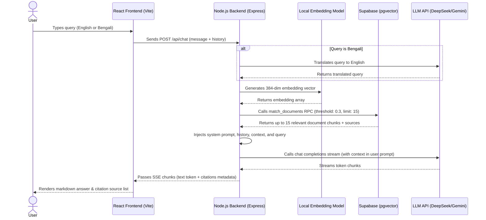

# AskNBR - NBR University RAG Chatbot

AskNBR is a highly professional, lightweight, and high-performance Retrieval-Augmented Generation (RAG) chatbot designed to answer complex tax, act, and regulatory queries using the National Board of Revenue (NBR) VAT documents. It features bilingual query support, multi-format file ingestion (PDF & Image OCR), and conversation memory.

---

## 🚀 Features Checklist

- **[x] Bilingual Support:** Automatically detects Bengali queries, translates them to English for optimal semantic database matches, and replies in the user's original language.
- **[x] DeepSeek / Gemini Dynamic LLM:** Configured with swappable LLM endpoints (supporting DeepSeek API, Google Gemini, Ollama, etc.) via simple environment variables.
- **[x] Multi-format Ingestion with OCR:** Parses standard PDFs and runs high-accuracy image OCR (`.png`, `.jpg`, `.jpeg`) using Tesseract.js with bilingual (`eng+ben`) models.
- **[x] Streaming Server-Sent Events (SSE):** Token-by-token streaming response to the frontend client for a low-latency chat experience.
- **[x] Conversation Memory:** Retains conversation history (sliding window of the last 4-6 messages) to maintain contextual coherence across multiple turns.

---

## 🏗️ Architecture Diagram

The flow below illustrates how a user query traverses the React frontend, triggers semantic translation, generates embeddings locally, queries the Supabase vector database, and streams the response back via SSE.



---

## 💻 Tech Stack

- **Frontend:** React 19, Vite 8, Tailwind CSS v4, React Markdown, CSS Glassmorphism
- **Backend:** Node.js, Express, OpenAI SDK, Tesseract.js (OCR), Xenova Transformers (`all-MiniLM-L6-v2`)
- **Database:** Supabase (PostgreSQL with `pgvector` extension)
- **Containerization:** Docker & Docker Compose

---


## 🧱 Supabase Database Schema Setup

Ensure `pgvector` is enabled in your Supabase project. Run the SQL snippet below in the **SQL Editor** of your Supabase dashboard:

```sql
-- Enable vector extension
create extension if not exists vector;

-- Create documents storage table
create table if not exists documents (
  id bigserial primary key,
  content text not null,
  metadata jsonb,
  embedding vector(384) -- Matches dimensions of Xenova/all-MiniLM-L6-v2
);

-- Cosine similarity match RPC function
create or replace function match_documents (
  query_embedding vector(384),
  match_threshold float,
  match_count int
)
returns table (
  id bigint,
  content text,
  metadata jsonb,
  similarity float
)
language plpgsql
as $$
begin
  return query
  select
    documents.id,
    documents.content,
    documents.metadata,
    1 - (documents.embedding <=> query_embedding) as similarity
  from documents
  where 1 - (documents.embedding <=> query_embedding) > match_threshold
  order by documents.embedding <=> query_embedding
  limit match_count;
end;
$$;

-- Create HNSW speed index for search optimization
create index if not exists documents_embedding_hnsw_idx 
on documents using hnsw (embedding vector_cosine_ops);
```

---

## 🧠 Architectural Decisions

### 1. Cost-Efficient Local Embeddings (`Xenova/all-MiniLM-L6-v2`)
Instead of calling third-party APIs (like OpenAI `text-embedding-3-small`) on every ingestion phase and query search, AskNBR generates vectors locally using `@xenova/transformers`.
- **Zero API Cost & Rate Limits:** Runs entirely locally on CPU, ensuring search querying is free.
- **Optimized Dimensionality:** Employs the compact `all-MiniLM-L6-v2` model (384 dimensions), which drastically reduces memory footprint and optimizes indexing lookup speeds compared to `1536` dimension models.

### 2. Translation & Bilingual Alignment Pipeline
To guarantee matching accuracy, Bengali queries are dynamically translated to English before vector matching:
- **Semantic Consistency:** NBR documentation and regulations are historically written/structured in English. Translating queries to English ensures high-accuracy database search hits.
- **Strict Grounding:** The system prompt instructs the LLM to translate context responses back to Bengali only if the user query was in Bengali, enforcing zero hallucination and strict grounding boundaries.

### 3. Context Injection Strategy
Document context is placed in the final **User Message** directly adjacent to the active user query instead of the System message. This structural hierarchy keeps contextual facts close to the query prompt, improving model concentration and compliance.
